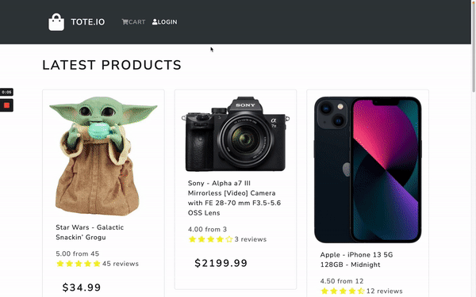

# Tote.io

<p align="center">
  
</p>

---

An Ecommerce site project with a landing page, detailed product page and add to cart functionality. <br>
Tote.io is a CRUD RESTful API application that utilizes the Django and React frameworks. Django handles the server, React to create the frontend of the application, Redux and manage and organize components state and  PostgresQL database hosted using Heroku to save data.<br>

## Tech stack

- Django/Python, React/Javascript, Postgresql, AWS, Redux

## User flows

As a user, I want to:
- login or sign up to create an account
- view a landing page with products basic information.
- view a product's detailed information(images,description, prices, amount in stock/out of stock, )
- view product reviews and ratings
- add products to a full featured shopping cart
- the app to be responsive and mobile friendly

## Usage
---
1. Fork and clone this [repository](https://github.com/lawrencesalinas/Tote.io-.git) then run the following command in your terminal
    * ```pip install``` on the root folder to install Django dependencies.
    * run ```pipenv shell```  after installation to activate the project envorinment.
    * ```python manage.py runserver``` to start the server...
2. Once the server is up and running,  run the following commands
  * ```cd backend```  then ```cd frontend ```to access the frontend folder.
    * ```npm install``` to install dependencies.
    *  ```npm start``` to launch the app in your browser.
  

## Cloud Deployment
The app is deployed on Heroku and can be accessed [here](https://tote-io.herokuapp.com/)

## Contributors

- [Lawrence Salinas](https://github.com/lawrencesalinas)


